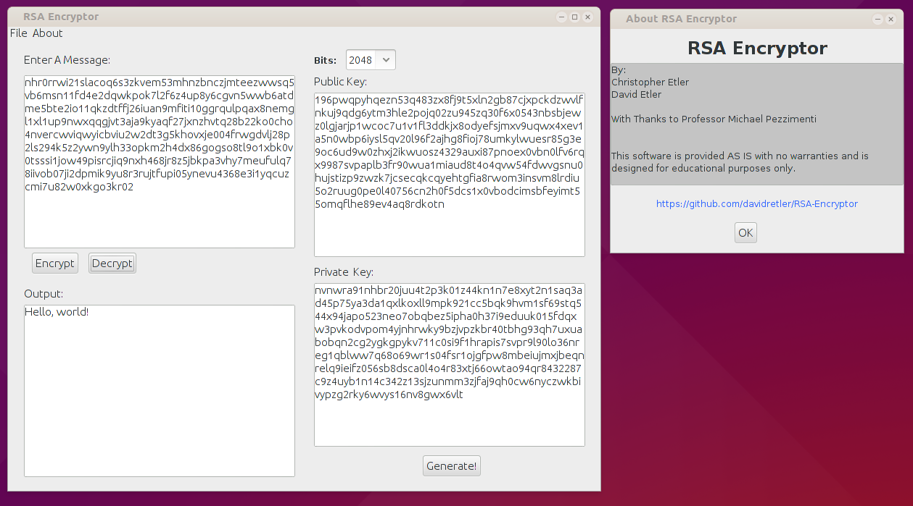
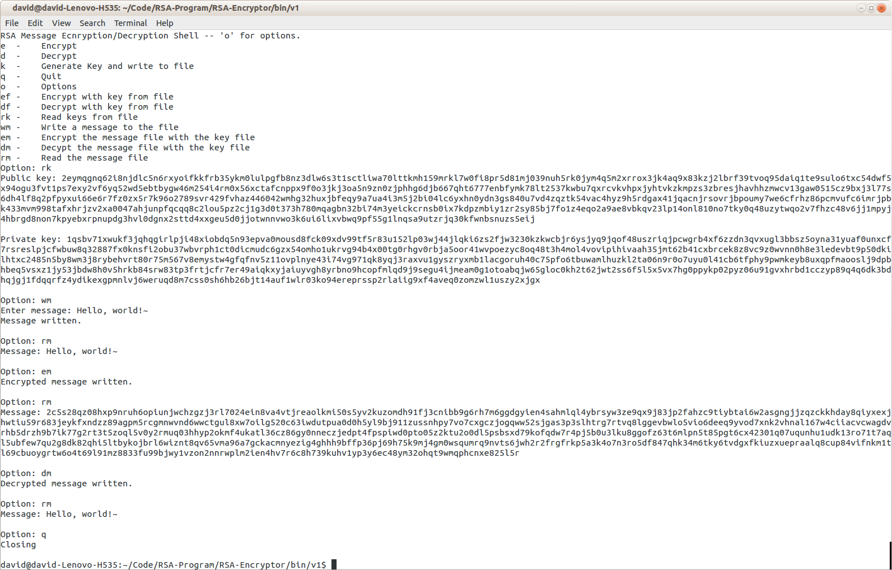

#RSA-Encryptor

##Overview
This is an RSA encryption program my brother and I wrote for a Discrete Math honors project.

##Features
This program implements the following aspects of RSA encryption:

* Key generation
* Plain-text message encryption
* Message decryption
* Supports various different key sizes
* Saving keys and messages to a file

The software comes with a command-line front-end as well as a GUI.

##How to Run
You can run the program by downloading the `.jar`s in the [`bin/v1`](bin/v1) directory. The program comes separately as a [GUI](bin/v1/RSA_GUI.jar) and a [CLI](bin/v1/RSA_CLI.jar) frontend. 

For example, to run the GUI you would type:

    java -jar ./RSA_GUI.jar

in the directory `RSA_GUI` was downloaded to.

##Screenshots
Here are a couple screenshots

##Disclaimer
This software is merely a proof-of-concept. It is not designed to be a legitimate encryption tool. Data encryption is a very sensitive endeavor and you should always use well-tested and well-supported encryption software. This software is provided for educational purposes only and is not intended for legitimate use.
