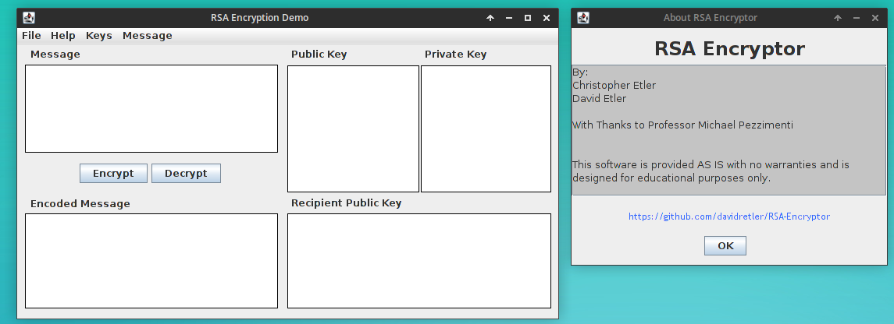
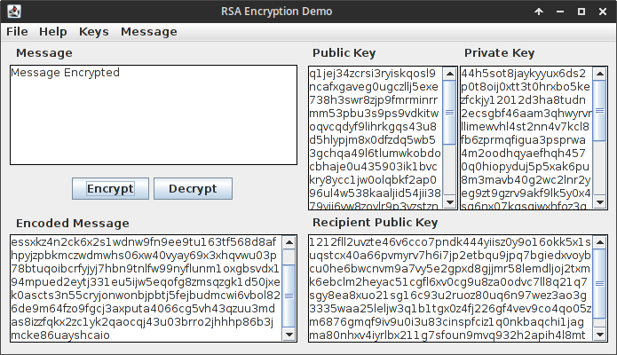
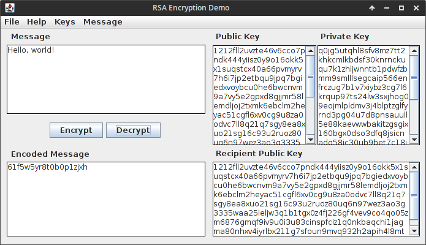

#RSA-Encryptor
By David and Chris Etler

##Overview
This is an RSA encryption program my brother and I wrote for a Discrete Math honors project.

##Features
This program implements the following aspects of RSA encryption:

* Key generation with various different key sizes
* Encryption and decryption of small messages
* Message hashing and signing
* Saving keys and messages to files for transfer and storage
* Rich GUI giving access to all these features

The software comes with a command-line front-end as well as a GUI.

##How to Run
You can run the program by downloading the `.jar` in the [`build/v2`](build/v2.1) directory. The program comes as a [GUI](build/v2.1/RSA_demo.jar). Previously, the program came with an optional CLI, but that has been deprecated and is no longer being updated.

To run the program, use the command: `java -jar RSA_Demo.jar` in the directory of the program. If this version does not run correctly, try the legacy version (`RSA_Demo_Legacy`) which is compiled for older versions of JRE.

##Screenshots
Overall interface:

Encrypted message:

Message decrypted:

##Changelog
Check out the changelog [here](CHANGELOG.md)

##Disclaimer
This software is merely a proof-of-concept. It is not designed to be a legitimate encryption tool. Data encryption is a very sensitive endeavor and you should always use well-tested and well-supported encryption software. This software is provided for educational purposes only and is not intended for legitimate use.
